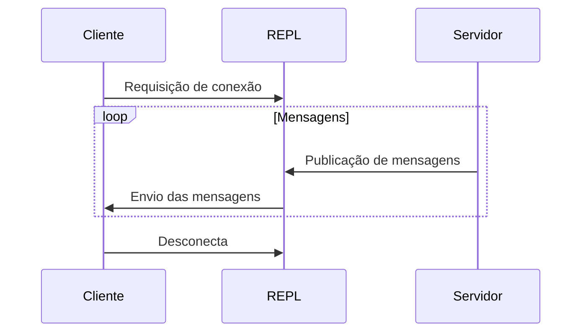

# Roteiro de apresentação

## Introdução

- O objetivo do nosso trabalho é a construção de sistema de mensageria que atenda os requisitos da web atual com relação ao tempo real;
- Propor uma arquitetura de microsserviços que simplifique a implementação desses sistemas.

## Detalhes dos sistemas em tempo real

-  Quando falamos em sistemas em tempo real para web, estamos falando de sistemas que precisam de uma resposta rápida para o usuário, enviando atualizações para o cliente sem que ele precise fazer requisições ao servidor.
- Um detalhe importante desses sistemas é a necessidade de compartilhamento de estado, sendo ele o estado de memória ou o estado de conexão uma conexão estabelecida.
- Um ponto que deve ser frisado aqui é a escala da web, que pode extender de algumas dezenas de usuários até milhões de usuários simultâneos.
- Portanto, um ponto que deve ser levado em consideração é a escalabilidade do sistema, que deve ser capaz de atender a demanda de usuários simultâneos.

## Diferenciação de arquiteturas

### Escalabilidade vertical

- A escalabilidade vertical é o aumento de capacidade de processamento de um sistema através do acréscimo de hardware na máquina.
- Esse tipo de escalabilidade é limitado pelas limitações físicas da máquina, como a quantidade de memória RAM, a quantidade de processadores, a quantidade de núcleos, etc.
- Além disso, a escalabilidade vertical também é limitada pelas limitações de linguagem, como a quantidade de memória que um processo pode alocar, a quantidade de threads que um processo pode criar, etc.
- Por fim, a escalabilidade vertical também é limitada pelas limitações de rede, como a quantidade de conexões que uma placa de rede pode estabelecer, a quantidade de conexões que um sistema operacional pode estabelecer, etc.

### Escalabilidade horizontal

- A escalabilidade horizontal é o aumento de capacidade de processamento de um sistema através do acréscimo de máquinas.
- Esse sistema tende a ser menos custoso que o sistema de escalabilidade vertical, pois o custo de várias máquinas menores costuma ser menor que o custo de uma única máquina mais potente.
- Sistemas que utilizam escalabilidade horizontal geralmente são implementados utilizando o conceito de microsserviços
- O conceito de microsserviços é a divisão de um sistema em vários serviços, que são executados em máquinas diferentes, possibilitando um sistema modular e escalável ao nível de serviço.
- Entretanto, existe a complexidade de implementação, uma vez que quando falamos de escalabilidade horizontal, estamos falando de um sistema distribuído, que possui problemas de comunicação entre os serviços, problemas de consistência de dados, problemas de concorrência, etc.
- Aqui vamos citar três exemplos comumente utilizados na web, quando falamos de escalabilidade e gerenciamento de máquinas, sendo sistemas utilizando kubernetes, serverless e edge.
- Os sistemas serverless e edge funcionam na premissa de requisição e resposta, onde o cliente faz uma requisição e o servidor responde, não existindo a permanência da conexão entre o cliente e o servidor;
- O sistema kubernetes funciona na premissa de um cluster com vários pods que executam um determinado sistema, não possuindo a limitação dos exemplos citados anteriormente, entretanto, existe a complexidade de implementação de um sistema distribuído e da distribuição de mensagens.
- A proposta do nosso sistema de mensageria é resolver o problema da implementação dos sistemas em tempo real para esses ambientes, possibilitando a implementação de sistemas em tempo real de forma simples e escalável;

